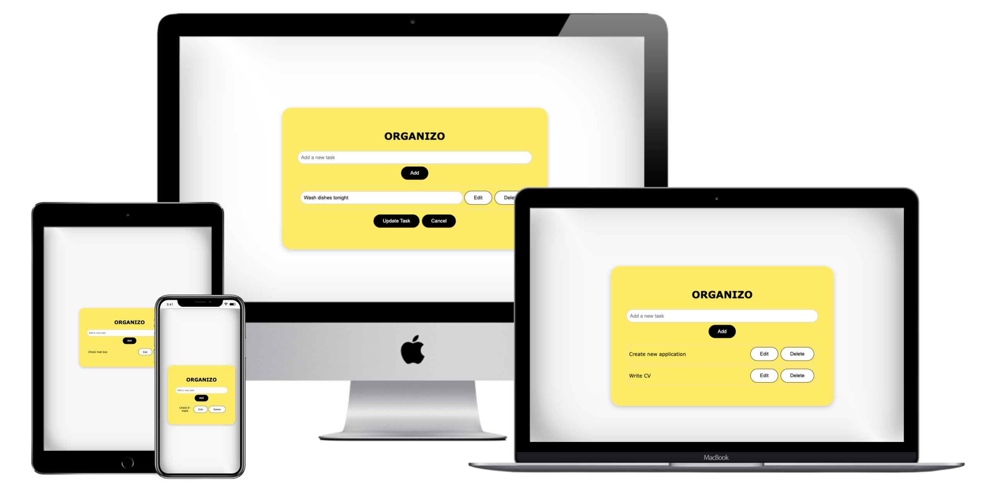

# Organizo : React To-Do List App



Organizo is a simple React application that allows users to create, read, update, and delete (CRUD) tasks in a to-do list.

## Getting Started

Follow these instructions to get a copy of the project up and running on your local machine for development and testing purposes.

### Prerequisites

Make sure you have Node.js and npm installed on your machine.

- [Node.js](https://nodejs.org/)

### Installing

1. Clone the repository to your local machine.

```bash
git clone https://github.com/aria-vero-s/organizo.git
```

2. Navigate to the project folder.
```bash
cd my-react-app
```
3. Install dependencies.
```bash
npm install
```

### Running the App
Start the development server.

```bash
npm start
```
Open your browser and go to http://localhost:3000 to view the app.

### Features
- Add new tasks to the to-do list.
- Delete tasks from the list.
- Edit task text.

### Built With
- React
- HTML
- CSS

### Authors
Ariane [GitHub](https://github.com/aria-vero-s)

### Acknowledgments
This project was created as a learning exercise.
Feel free to customize and expand the functionality.
Have fun coding!